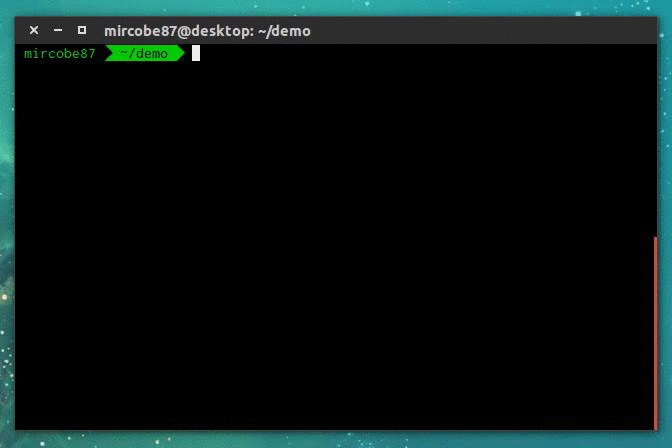

# FUCK command

This is a simple utility to run the last executed command with `sudo`.



## How to install
1. Clone this repo wherever you want.
   ```
   git clone https://github.com/mircobe87/fuck-cmd.git
   ```

2. Copy the `fuck.sh` source file into your home directory.
   ```
   cp ./fuck-cmd/fuck.sh ~/
   ```

3. Edit your bash config file to load this command. For instance, put this code into `~/.bashrc`:
   ```
   if [ -f ~/fuck.sh ]; then
     source ~/fuck.sh
   fi
   ```
